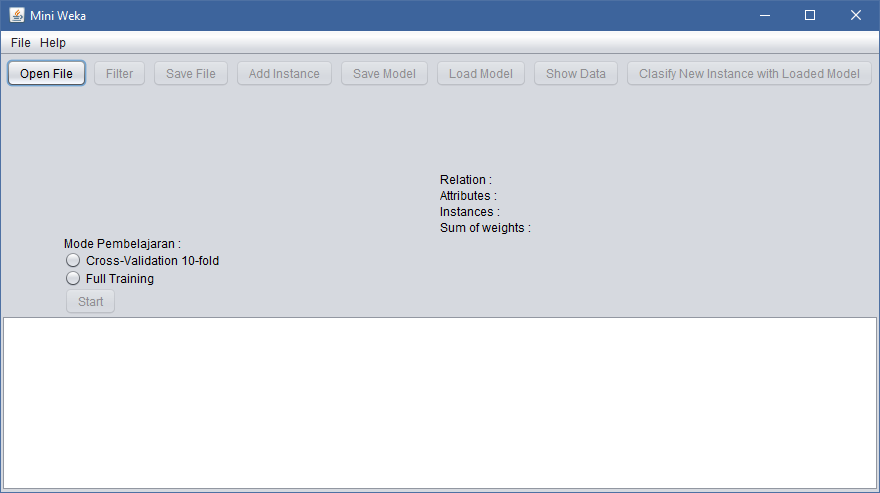

# Mini Weka

Weka implementation using Weka API.

## Main Window Interface

## Overview

This application implement classifier J48, doing cross-validate and full training. What features you can get from here? Because this mini application so little function you can get. The function are :

* Load data set.

* Save data set.

* Load model data.

* Save model data.

* Classify a Instance.

* Add Instance. (Must be a valid Instance)

For test application I use *iris.arff* data set that provide by WEKA. Example test you can see from this [document](documents/example.md).

## Contributor and Created By

Created By : Bervianto Leo Pratama